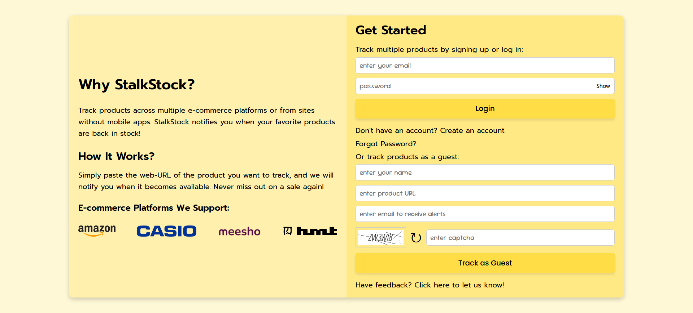
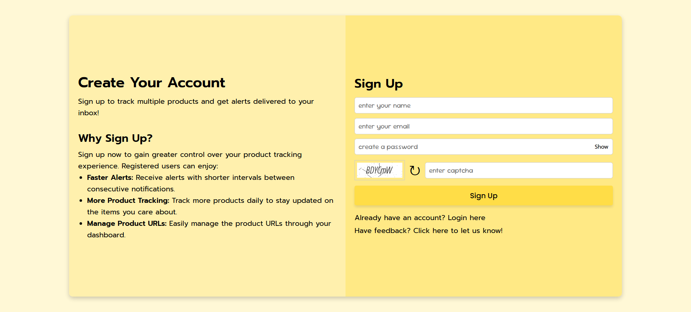
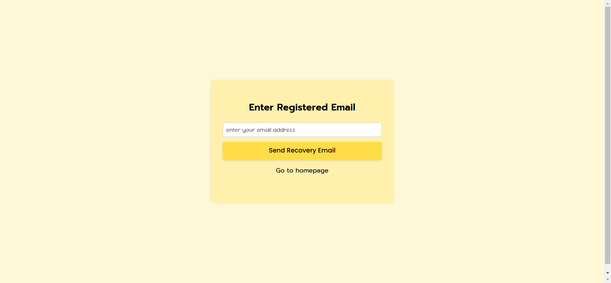
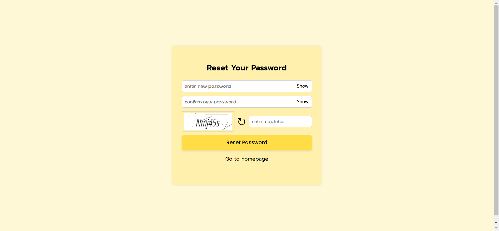

# [StalkStock](https://stalkstock.in): Your Personalized Product Tracker

StalkStock is a web-based application designed to help you track product availability effortlessly. Whether you're a guest or a registered user, you can set up alerts and never miss out on your favourite products again.

---

## How It Works?

1. Simply paste the web-URL of the product you want to track.
2. StalkStock monitors the product availability and sends you email alerts when the product becomes available.
3. Enjoy hassle-free tracking and stay updated!

---

### Technologies Used

- **Back-end**: PHP, MySQL
- **Front-end**: HTML, CSS, JavaScript, SweetAlert
- **Web Scraping**: cURL
- **Automation**: Hostinger’s Cron Jobs for periodic data scraping

---

### Supported Websites

- [HMT Watches](https://www.hmtwatches.in/)
- [Meesho](https://www.meesho.com/)
- [Casio India](https://www.casioindiashop.com/)
- [Amazon](https://www.amazon.in/)

---

### Features

#### **1. User Roles**

##### a) Guests:

- Can track up to **3 product URLs** per email ID.

##### b) Registered Users:

- Can track up to **7 product URLs daily**.
- Manage product URLs and alerts through a user-friendly **dashboard**.

#### **2. Validation**

- **Name & Email**: The name must be at least 5 characters long, and a valid email address is required.
- **Product URLs**: Must be valid, supported, and belong to the e-commerce platforms mentioned above.
- **Tracking Restrictions**: A product URL can only be tracked once entered for the next **60 days**.
- **CAPTCHA Implementation**: CAPTCHA has been implemented at appropriate locations to ensure security and prevent automated submissions.

#### **3. Cron Job Logging and Scraping Frequency**

- Web scraping is automated and performed every 30 minutes using Hostinger's cron jobs.
- Logs are maintained for all cron job executions, capturing timestamps and actions for easy monitoring. for better monitoring and debugging.

#### **4. Alert Management**

- Product URLs are included in the alert email for easy access.
- A certain **cooldown period** is enforced between consecutive emails to avoid spamming.
- **Email Alerts Restrictions**:
  - Registered users: Maximum **4 alerts per product per day**.
  - Guests: Limited to **3 alerts per product**.

#### **5. Password Recovery**

- Allows registered users to reset their password via a secure link sent to their registered email address.
- The password reset link is valid for **15 minutes** to ensure security.

#### **6. Feedback & Suggestions**

- A Google Form is implemented to allow users to submit their feedback and suggestions for continuous improvement.

#### **7. Mobile Responsiveness**

- Designed to provide a seamless user experience across various devices, including desktops, tablets, and mobile phones.
- Ensures optimal usability and accessibility with a responsive layout.

---

### Future Enhancements

- **Additional Platform Support**: Support to few more e-commerce platforms.
- **Price Drop Alerts**: Users can receive alerts based on their specified price drop threshold.

---

### Hosting

The web application is hosted at: stalkstock.in

---

### Screenshots

- Home Page : 
- Signup Page : 
- User Dashboard : 
- Forgot Password Page : 
- xReset Password Page : 

---

### About Me

You can learn more about me and my other projects on my [personal portfolio website](https://siddheshmestri.online).
