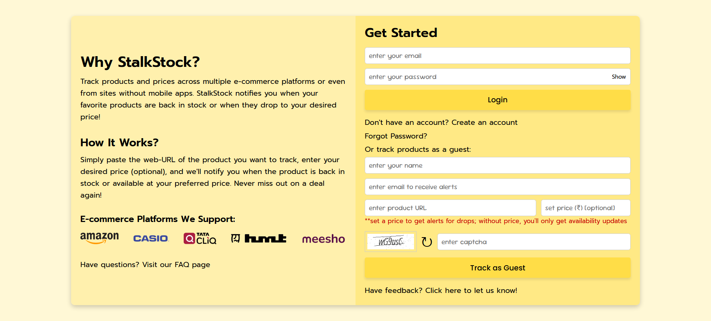
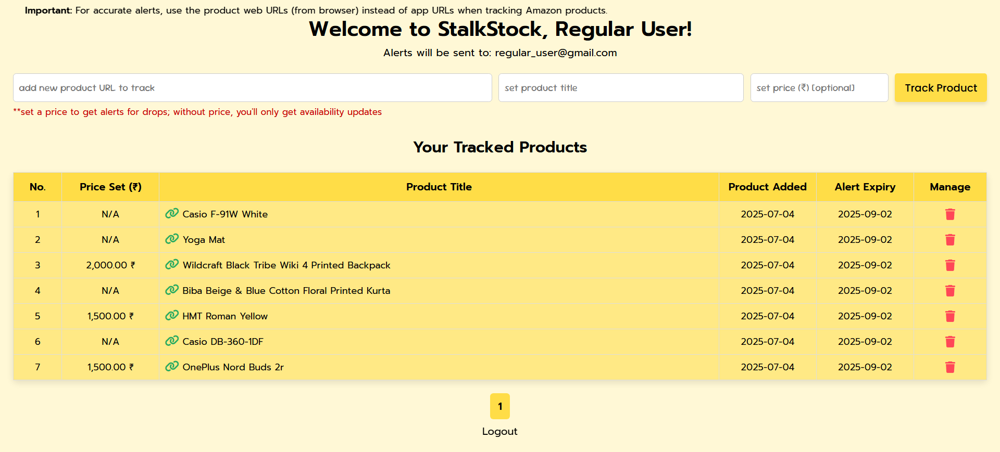

# [StalkStock](https://stalkstock.in): Your Personalized Product Tracker

StalkStock is a web-based application designed to help you effortlessly track product availability and get notified when your favourite products are back in stock or when their price drops. Whether you're a guest or a registered user, you can set up alerts and never miss out again.

---

## How It Works?

1. Simply paste the web URL and the desired price (optional) of the product you want to track.
2. StalkStock monitors the product's availability and price (if set) and sends you email alerts when the product becomes available or drops below your desired price.
3. Enjoy hassle-free tracking and stay updated!

---

### Technologies Used

- **Back-end**: PHP, MySQL
- **Front-end**: HTML, CSS, JavaScript, SweetAlert
- **Web Scraping**: cURL
- **Automation**: Hostinger’s Cron Jobs for periodic data scraping

---

### Supported Websites

- [Amazon](https://www.amazon.in/)
- [Casio India](https://www.casioindiashop.com/)
- [Tata Cliq Fashion](https://www.tatacliq.com/)
- [HMT Watches](https://www.hmtwatches.in/)
- [Meesho](https://www.meesho.com/)

---

### Features

1. **User Roles**

   - **Guests:**
     - Can track up to 3 product URLs per email ID daily.
   - **Registered Users:**
     - Can track up to 7 product URLs daily.
     - Manage product URLs and alerts through a user-friendly dashboard.

2. **Validation**

   - **Name & Email:** The name must be at least 5 characters long, and a valid email address is required.
   - **Product URLs:** Must be valid, supported, and belong to the e-commerce platforms mentioned above.
   - **Tracking Restrictions:** A product URL can only be tracked once entered for the next 60 days.
   - **CAPTCHA Implementation:** CAPTCHA has been implemented at appropriate locations to ensure security and prevent automated submissions.

3. **Cron Job Logging and Scraping Frequency**

   - Web scraping is automated and performed every 30 minutes using Hostinger's cron jobs.
   - Logs are maintained for all cron job executions, capturing timestamps and actions for easy monitoring and debugging.

4. **Alert Management**

   - Product URLs are included in the alert email for easy access.
   - A certain cooldown period is enforced between consecutive emails to avoid spamming.
   - **Email Alerts Restrictions:**
     - **Registered users:** Maximum 4 alerts per product per day.
     - **Guests:** Limited to 3 alerts per product.

5. **Password Recovery**

   - Allows registered users to reset their password via a secure link sent to their registered email address.
   - The password reset link is valid for 15 minutes to ensure security.

6. **Feedback & Suggestions**

   - A Google Form is implemented to allow users to submit their feedback and suggestions for continuous improvement.

7. **Mobile Responsiveness**

   - Designed to provide a seamless user experience across various devices, including desktops, tablets, and mobile phones.
   - Ensures optimal usability and accessibility with a responsive layout.

8. **FAQ Section**

   - An FAQ section has been added to address common questions and help users quickly find relevant information.

9. **Price Alert Feature**
   - **Desired Price:** Users can now set a desired price for the products they are tracking (optional).
   - **Price-based Alerts:** If the desired price is set, users will be alerted if the product price falls below the set value, as long as the product is available.
   - **Availability-based Alerts:** Alternatively, users can be notified based on product availability, without price considerations.

---

### `.htaccess` Configuration (Deployed Only)

This project leverages a robust `.htaccess` file (not maintained locally or in this repository) to ensure secure and seamless functionality. Below is an outline of the key rules configured:

- **Disable Directory Listing:** Prevents directory contents from being exposed to unauthorized users
- **Protect `.htaccess` File:** Restricts access to the `.htaccess` file itself.
- **Block Sensitive Files:** Denies access to files containing sensitive information (e.g. `.env`, `.json`).
- **Restrict PHP File Access:** Limits access to specific PHP files to avoid unauthorized use.
- **Secure Directories:** Prevents access to sensitive directories (e.g. `logs`, `media`).
- **Localhost-Only Scripts:** Ensures certain scripts are accessible only from `127.0.0.1`, enabling secure execution by Cron jobs in this project's context.
- **Hide Server Details:** Removes the `X-Powered-By` header for security.
- **Enforce HTTPS:** Redirects all HTTP requests to HTTPS for secure communication.
- **URL Token Validation:** Validates tokens in password recovery URLs to prevent misuse.
- **Redirect All PHP Files:** Redirects `.php` files to `index.php` unless explicitly whitelisted.
- **Remove `.php` Extensions:** Enables cleaner URLs by omitting the .php extension.
- **Cache Static Assets:** Sets long-term caching for static files (e.g., CSS, fonts) to enhance performance.

This `.htaccess` setup ensures secure, efficient, and professional deployment of the application.

---

### Future Enhancements

- **Additional Platform Support**: Support to few more e-commerce platforms.

---

### Hosting

The web application is hosted at: stalkstock.in

---

### Screenshots

- Home Page : 
- Signup Page : 
- User Dashboard : 
- Forgot Password Page : 
- Reset Password Page : 
- FAQ Page : 

---

### About Me

You can learn more about me and my other projects on my [personal portfolio website](https://siddheshmestri.online).
